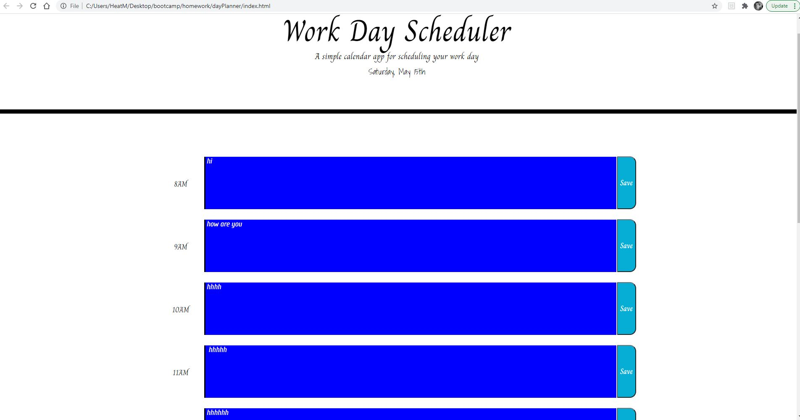
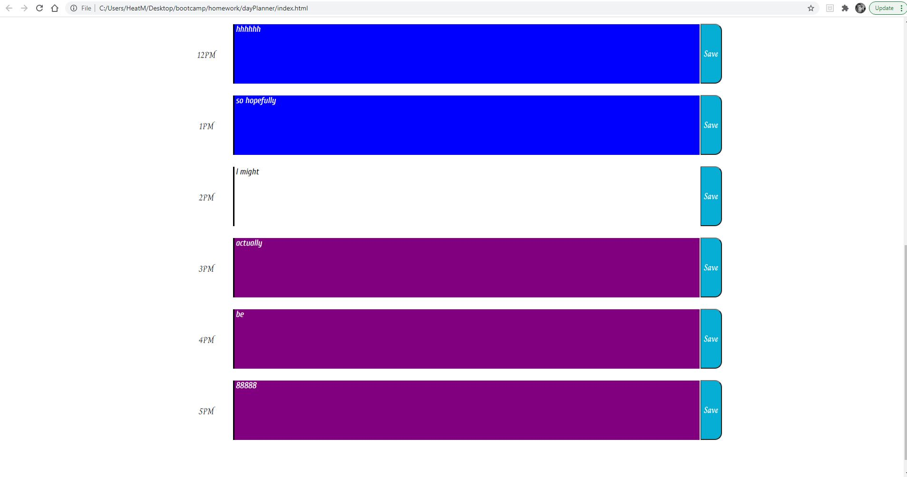

# dayPlanner
Making a thing that's makes me wish I was a little more organized. I should really consider using a day planner, but I've tried, I failed, so the whole let's start it up again feels a little mute. I digress. Anywho . . . 

## The Assignment

### Third-Party APIs: Work Day Scheduler

#### Task

- Create a simple calendar application that allows a user to save events for each hour of the day by modifying starter code. 

- This app will run in the browser and feature dynamically updated HTML and CSS powered by jQuery.

- Use Luxon library to work with date and time. Be sure to read the documentation carefully and concentrate on using Moment.js in the browser.

#### Acceptance Criteria

- When the user opens the planner
    - the current day is displayed at the top of the calendar

- When the user scrolls down
    - they are presented with timeblocks for standard business hours

- When the user view the timeblocks for that day
    - each timeblock is color coded to indicate whether it is in the past, present, or future

- When the user clicks into a timeblock
    - they are able to enter an event

- When the user clicks the save button for that timeblock
    - the text for that event is saved in local storage

- When the user refreshes the page
    - the saved events persist

## The Results

## Link to the Website 

https://heatmarie.github.io/dayPlanner/

## Comments 

So here we have it. A new day planner that I will never use. And only because I struggle with the use of them. So how did this go? 

Using Luxon was actually pretty simple. 

